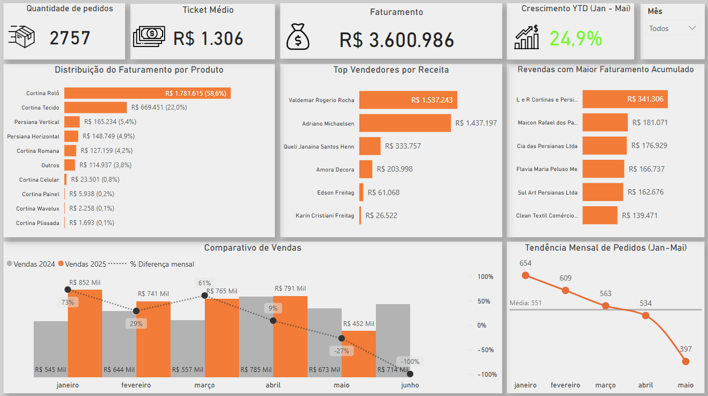
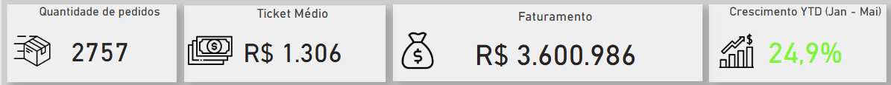
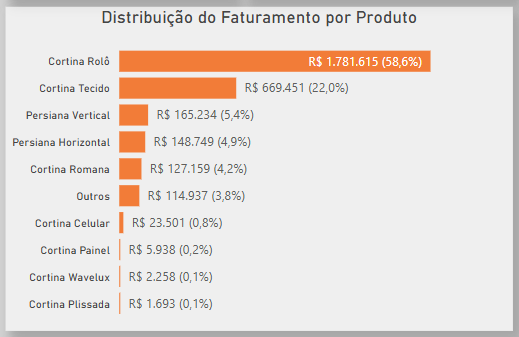
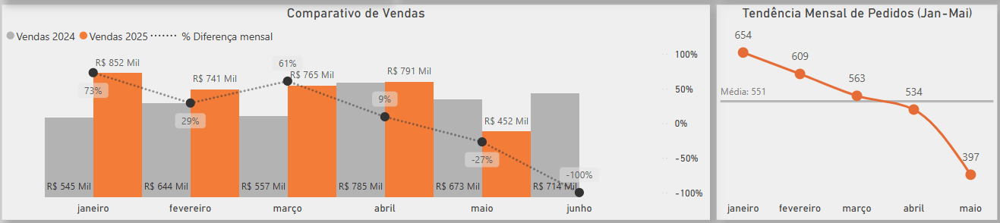

# 📊 Relatório Anual de Vendas — Power BI

Este projeto consiste em um dashboard interativo desenvolvido no Power BI, voltado para a **gerência comercial** da empresa. O objetivo principal é fornecer uma **visão geral (overview)** do desempenho de vendas ao longo do ano, com foco em facilitar a análise estratégica e operacional por meio de filtros dinâmicos e recursos visuais intuitivos.

---

## 🧭 Objetivo

O relatório foi construído para permitir à gerência:

- Acompanhar o desempenho de vendas de forma agregada e detalhada;
- Comparar os resultados de 2024 e 2025 (até maio);
- Identificar rapidamente os produtos, vendedores e canais mais rentáveis;
- Mitigar problemas e tomar decisões com base em dados interativos.

---

## 🗂️ Fontes e Modelagem de Dados

- **Fonte de dados**: Relatórios extraídos de um **ERP**, organizados em **planilhas Excel**.
- **Transformação**: Feita inteiramente no **Power Query**, garantindo consistência e qualidade dos dados.
- **Modelagem**: Estrutura em estrela, utilizando tabelas fato e dimensão, com relacionamento baseado em `Data`, `Produto` e `Nº Pedido`.

As principais tabelas são:
- `Total_Pedidos`
- `Pedidos 2024`
- `Pedidos por Tipo - Produtos` e `Geral`
- `Vendas 2024`
- `Dim_Calendário`

---

## ⚙️ Recursos Técnicos

- Ferramenta: **Power BI Desktop**
- Linguagem: **DAX** (Data Analysis Expressions) para construção de medidas
- Tratamento de dados: **Power Query**
- Visualizações: gráficos de barras, linha, comparativos e KPI cards
- Totalmente **interativo** com segmentações por mês, produto, vendedor, etc.

---

## 📌 Principais Métricas e Análises

- **Total de pedidos**
- **Ticket médio**
- **Faturamento total**
- **Crescimento YTD (Jan-Mai)**
- **Distribuição de faturamento por produto**
- **Top vendedores por receita**
- **Revendas com maior faturamento**
- **Tendência mensal de pedidos**
- **Comparativo ano a ano de vendas (2024 vs 2025)**

---

## 🖼️ Prévia do Relatório

### Visão Geral

### KPIs Resumo

### Faturamento por Produto

### Comparativo Vendas 2024 x 2025

---

## ▶️ Como Visualizar

1. Baixe o arquivo `.pbix` desejado.
2. Abra no **Power BI Desktop**.
3. Explore os filtros, gráficos e segmentações para obter insights customizados.

---

## 👤 Sobre o Autor

Este relatório foi desenvolvido como parte de um portfólio de projetos com o objetivo de demonstrar habilidades em:

- Visualização de dados
- Modelagem relacional
- Análise de indicadores de desempenho comercial
- Desenvolvimento de dashboards interativos no Power BI

---

